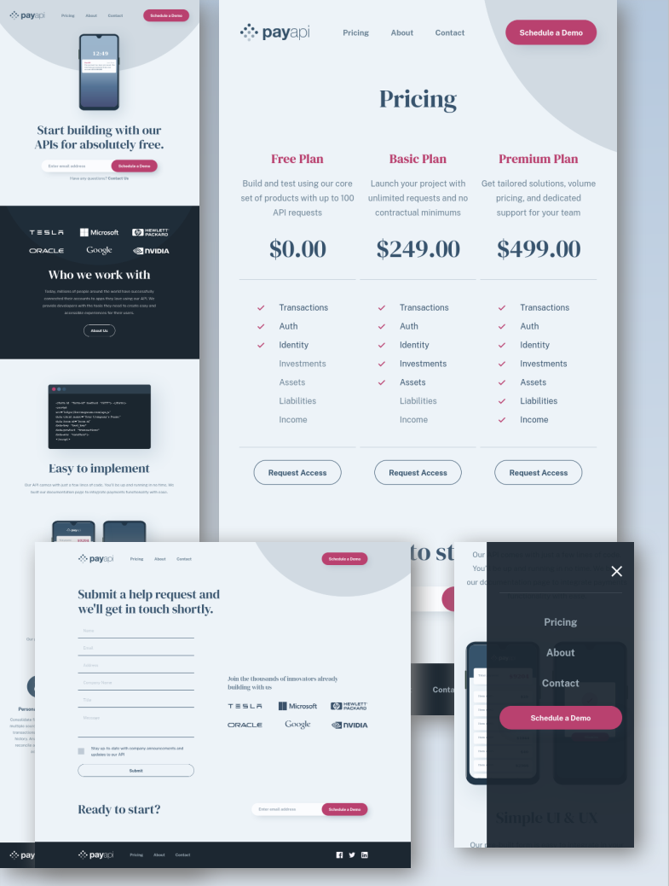

# Frontend Mentor - PayAPI multi-page website solution

This is a solution to the [PayAPI multi-page website challenge on Frontend Mentor](https://www.frontendmentor.io/challenges/payapi-multipage-website-FDLR1Y11e). Frontend Mentor challenges help you improve your coding skills by building realistic projects.

## Table of contents

- [Overview](#overview)
  - [The challenge](#the-challenge)
  - [Screenshot](#screenshot)
  - [Links](#links)
- [My process](#my-process)
  - [Built with](#built-with)
- [Author](#author)

## Overview

### The challenge

Users should be able to:

- View the optimal layout for each page depending on their device's screen size
- See hover states for all interactive elements throughout the site
- Receive an error message when the contact form is submitted if:
  - The `Name`, `Email Address` or `Message` fields are empty should show "This field can't be empty"
  - The `Email Address` is not formatted correctly should show "Please use a valid email address"

### Screenshot

Solution screenshot

### Links

- Live Site URL: [frontendmentor-payapi-multi-page-website.vercel.app](https://frontendmentor-payapi-multi-page-website.vercel.app/)

## My process

### Built with

- [React](https://reactjs.org/) - JS library
- React Router
- SASS/SCSS
- Semantic HTML5 markup
- Mobile-first workflow

## Author

- Frontend Mentor - [profile](https://www.frontendmentor.io/profile/aratur)
- Website - [linkedin](https://www.linkedin.com/in/artur-jedrzejczak/)
